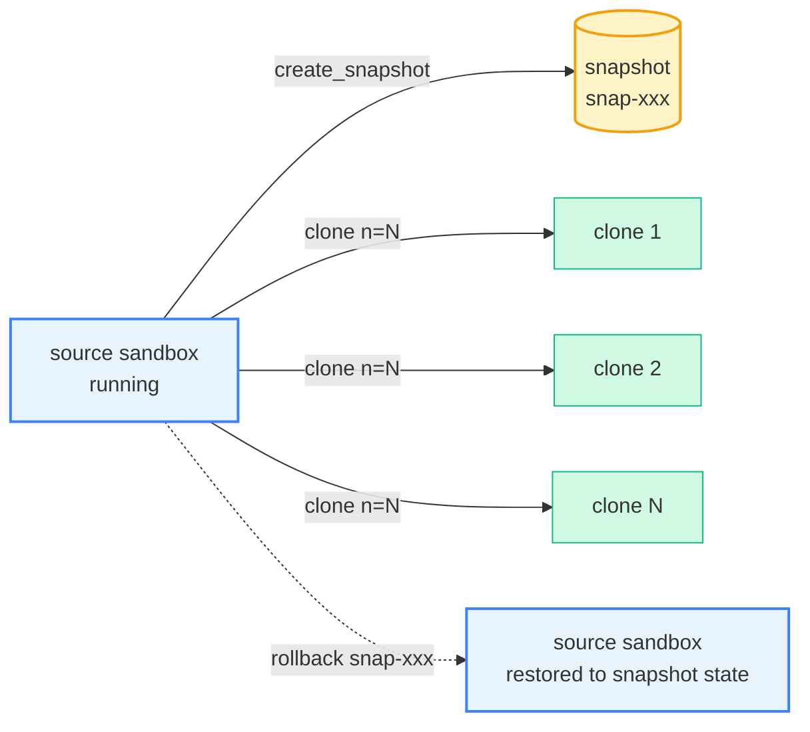

# Snapshot, Rollback & Clone

This guide covers three advanced APIs provided by the Cube Sandbox Python SDK:

- **Snapshot**: Persists the complete state (memory + filesystem) of a running sandbox as a reusable image. The snapshot can later be used to spawn new sandboxes or trigger a rollback.
- **Clone**: Calls `clone()` on a running sandbox to immediately derive N fully independent copies. Each copy starts from the source sandbox's current state and runs in isolation.
- **Rollback**: Restores a running sandbox to a previously captured snapshot state in place — the sandbox ID stays the same and execution can continue right away.

## Concept



| API | Target | Sandbox ID | Typical use |
|-----|--------|------------|-------------|
| `sb.create_snapshot()` | The source sandbox itself | Unchanged | Create a checkpoint or persist state |
| `sb.clone(n=N)` | Derive N new sandboxes from a running sandbox | N new IDs | Agent parallel rollout, repeatable experiments |
| `sb.rollback(snap_id)` | Restore the current sandbox to a snapshot state | **Unchanged** | Undo a failed step, branch from a saved point |

## Installation

> **Note**: Snapshot, rollback, and clone are Cube Sandbox-exclusive capabilities — the e2b SDK has no equivalent APIs. The [`cubesandbox`](https://pypi.org/project/cubesandbox/) SDK is compatible with the e2b SDK and can be used as a drop-in replacement, while adding these advanced features.

All APIs in this guide require [`cubesandbox`](https://pypi.org/project/cubesandbox/) **0.2.0 or later**.

```bash
pip install "cubesandbox>=0.2.0"
```

Environment variables used throughout the examples:

```bash
export CUBE_API_URL=http://127.0.0.1:3000
export CUBE_TEMPLATE_ID=tpl-xxxxxxxxxxxxxxxxxxxxxxxx
```

## Snapshot

`sb.create_snapshot()` persists the sandbox's current state (filesystem + memory) as a snapshot and returns a `SnapshotInfo` object. The `snapshot_id` field can be passed directly to `Sandbox.create(template=...)`.

```python
from cubesandbox import Sandbox

with Sandbox.create(template=TEMPLATE_ID) as sb:
    sb.run_code("open('/tmp/data.txt','w').write('hello')")
    snap = sb.create_snapshot()
    print(f"snapshot: {snap.snapshot_id}")
```

A snapshot's lifecycle is independent of the sandbox: the snapshot remains usable even after the source sandbox is `kill()`ed. Call `Sandbox.delete_snapshot(snapshot_id)` to clean up when it is no longer needed.

### Named snapshots (E2B compatibility)

Passing `name` to `create_snapshot` claims a **snapshot alias** in addition to the raw `snap-*` id. The returned `snapshot_id` becomes the qualified name `alias:tag` (tag defaults to `default`), matching official E2B — a single value that supports sorting, restore and deletion:

```python
snap = sb.create_snapshot(name="agentscope-run")
print(snap.snapshot_id)  # "agentscope-run:default"
print(snap.names)        # ["agentscope-run"]

# All three restore forms work (namespace prefixes are accepted and stripped):
Sandbox.create(template=snap.snapshot_id)          # "agentscope-run:default"
Sandbox.create(template="agentscope-run")          # bare alias (tag-less → :default)
Sandbox.create(template="team/agentscope-run")     # namespace stripped

Sandbox.delete_snapshot(snap.snapshot_id)          # delete by qualified name
sb.rollback(snap.snapshot_id)                      # rollback by qualified name
```

Rules for snapshot names:

- the alias and tag segments use the template-alias charset (`[a-z0-9-]`, 1–64 chars; tag ≤ 63 so the full key fits 128 characters);
- a name without a tag claims `alias:default`; an explicit tag (`"foo:v2"`) is kept verbatim and can coexist with `foo:default`;
- each qualified name is claimed by one snapshot at a time — re-creating it returns HTTP 409 until the previous snapshot is deleted;
- an invalid name (uppercase, `_`, reserved `tpl-`/`snap-` prefix, empty tag) does **not** fail the request: the snapshot is created unnamed and `snapshot_id` falls back to the raw `snap-*` id;
- deletion uses the exact qualified name (`alias:default`), never a derived default — a bare name that matches a template alias deletes the template, keeping create/delete precedence consistent. Unqualified deletion of a snapshot is not supported;
- template aliases and snapshot names live in disjoint key spaces (snapshot keys always contain `:`, template aliases never do). When a bare name matches both, the template wins.

Snapshots created before this feature keep their raw `snap-*` ids and remain fully usable; their historical `display_name` values were never validated and are not retroactively claimed as aliases.

### Listing snapshots

```python
# List snapshots (first page)
items, next_token = Sandbox.list_snapshots()

# Filter by sandbox_id
items, _ = Sandbox.list_snapshots(sandbox_id=sb.sandbox_id)
```

`list_snapshots()` returns `(list[SnapshotInfo], next_token)`. Pass `next_token` back to retrieve subsequent pages; `None` means no more pages.

## Clone

Calling `sb.clone(n=N)` on a running sandbox immediately derives N independent copies. Each copy fully inherits the source sandbox's runtime state at the moment of the clone call — memory and filesystem alike — but subsequent writes are fully isolated. The source sandbox keeps running unaffected.

```python
src = Sandbox.create(template=TEMPLATE_ID)
src.run_code("open('/tmp/shared.txt','w').write('hello')")

clones = src.clone(n=3)
for sb in clones:
    # Each clone inherits the file written in src
    out = sb.run_code("print(open('/tmp/shared.txt').read())").logs.stdout[0]
    assert out.strip() == "hello"
```

### Concurrent clone

By default clones are created serially. Pass `concurrency=C` for fan-out scenarios:

```python
clones = src.clone(n=10, concurrency=5)
```

- If any sub-task fails, already-created clones are automatically `kill()`ed. The caller either gets all N sandboxes or an exception — no orphaned resources.

### Inheritance and isolation

Clones returned by `clone()` satisfy three properties:

| Property | Meaning |
|----------|---------|
| **Inheritance** | Each clone's initial state is identical to the source sandbox at the moment of the clone call |
| **Isolation** | Writes in one clone are invisible to others and to the source sandbox |
| **Continuity** | The source sandbox keeps running after `clone()` returns, unaffected |

## Rollback

`sb.rollback(snapshot_id)` restores the sandbox **in place** to the specified snapshot state: the filesystem is fully reset, the **sandbox ID stays the same**, and the `sb` object remains usable.

```python
sb = Sandbox.create(template=TEMPLATE_ID)
sb.run_code("open('/tmp/v.txt','w').write('v1')")
checkpoint = sb.create_snapshot()

sb.run_code("open('/tmp/v.txt','w').write('v2')")
sb.rollback(checkpoint.snapshot_id)

after = sb.run_code("print(open('/tmp/v.txt').read())").logs.stdout[0]
assert after.strip() == "v1"
```

After a rollback the sandbox is still writable. You can continue execution and snapshot again — ideal for agent retry loops where you checkpoint at each key decision point, roll back on failure, and try a different branch:

```python
# Continue on the rolled-back branch
sb.run_code("open('/tmp/v.txt','w').write('v3')")
new_snap = sb.create_snapshot()

with Sandbox.create(template=new_snap.snapshot_id) as forked:
    out = forked.run_code("print(open('/tmp/v.txt').read())").logs.stdout[0]
    assert out.strip() == "v3"
```

## Best practices

- **Snapshots are not free.** Each snapshot corresponds to a full image in persistent storage. Delete snapshots when they are no longer needed, or run `list_snapshots()` periodically to clean up.
- **`with` blocks do not delete snapshots.** The context manager only calls `kill()` on the sandbox. Snapshots created with `create_snapshot()` must be deleted explicitly with `Sandbox.delete_snapshot()`.
- **`clone()` cleans up its internal snapshot automatically.** For temporary fan-out you do not need to manage snapshot lifecycle yourself — just call `clone()`.
- **For large-scale fan-out**, prefer `clone(n=N, concurrency=C)`. The SDK handles cleanup on failure and avoids orphaned resources.

## Reference

- [Cross-Node Snapshots](./cross-node-snapshot.md) — S3 backend, `remote_status=ready`, and scheduler rules for Resume / FromSnap on another node
- Example code: [`examples/snapshot-rollback-clone/`](https://github.com/TencentCloud/CubeSandbox/tree/master/examples/snapshot-rollback-clone)
- SDK source: [`sdk/python/`](https://github.com/TencentCloud/CubeSandbox/tree/master/sdk/python)
